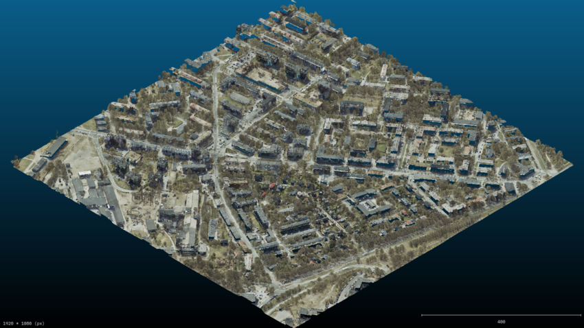
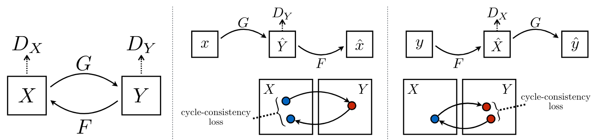

# Point Cloud Colorization using Image-to-Image Translation
Publication available on [ResearchGate](https://www.researchgate.net/publication/391392097_Point_Cloud_Colorization_using_Image-to-Image_Translation).

This project explores mapping LiDAR point cloud attributes (coordinates, intensity) to color representations using cross-domain image-to-image translation with GANs. We project top-view images from LiDAR data and train different GAN models (pix2pix, CycleGAN) to generate colored representations while preserving structural consistency.

Experiments were run on diverse datasets (City of Melbourne 3D Data, Estonia 3D LiDAR), evaluating results with FID, IS, SSIM, LPIPS, and TV loss. We found that using only Z-coordinate data reduced noise, and pretraining on map-to-aerial datasets improved structure learning. CycleGAN, with cycle-consistency and LPIPS, outperformed pix2pix in preserving geometry and visual fidelity.

The final outputs are colorized point clouds reconstructed into a 3D view.

## Models
- Pix2Pix Unet + Resnet
- CycleGAN Unet + Resnet
- Progressive Growing of GANs

## Dataset
[Melbourne 3D Data](https://data.melbourne.vic.gov.au/explore/dataset/city-of-melbourne-3d-point-cloud-2018/)

[Estonia](https://geoportaal.maaamet.ee/eng/Maps-and-Data/Elevation-data/Download-Elevation-Data-p664.html)
